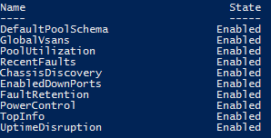

Ucs-Puptr aims to make management of tests that do/do not apply to your environment very simple.
You can easily disable any test:

# Disable Puptr Tests

You can use Get-PuptrTest to get a list of available tests and their state:

[](images/get-puptrtest.png)

Once you have that, you can disable any test by name

```PowerShell
Disable-PuptrTest -Name ChassisDiscovery
```

Run Get-PuptrTest again and we get:

[](images/disable-puptrtest.png)

That's it!