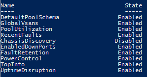

Ucs-Puptr aims to make management of tests that do/do not apply to your environment very simple.
You can easily enable any test:

# Enable Example

Let's assume out ChassisDiscovery test from the Disable Example is still disabled:

Run Get-PuptrTest

[](images/disable-puptrtest.png)

If you decide to re-enable that test, you can run:

```PowerShell
Enable-PuptrTest -Name ChassisDiscovery
```

Run Get-PuptrTest again:

[](images/get-puptrtest.png)

All Done!