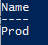

Ucs-Puptr aims to make management of configurations for your environment very simple.
You can easily backup/export a configuration:

# Export Puptr Configuration

Let's assume we have one Prod configuration:

Running Get-PuptrConfig would show:

[](images/get-puptrconfig.png)

If we want to export that configuration to our D: drive, we would run:

```PowerShell
Export-PuptrConfig -Name Prod -Path D:\
```

This would result in a Prod.ps1 file in our D: drive.

This could then be imported using Import-PuptrConfig