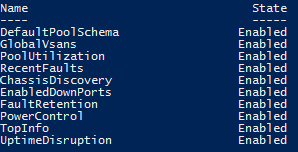

Ucs-Puptr aims to make management of tests that do/do not apply to your environment very simple.
You can easily get a list of available tests:

# Get Puptr Tests

Run Get-PuptrTest

```PowerShell
Get-PuptrTest
```

[](images/get-puptrtest.png)

You can also limit the search based on state

```PowerShell
Get-PuptrTest -State Disabled
```

Or based on type of tests

```PowerShell
Get-PuptrTest -Type Simple
```