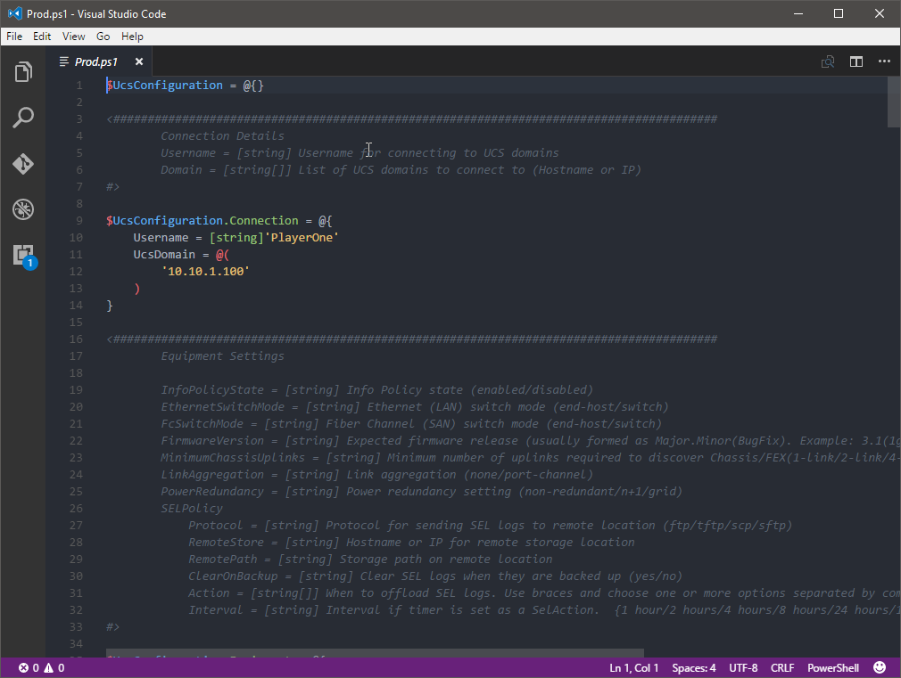

Ucs-Puptr aims to make management of configurations for your environment very simple.
You can easily create a new configuration:

# Create Puptr Configuration

> Note: This step is necessary before first using Ucs-Puptr

Using New-PuptrConfig you can create a configuration named Prod, which will the be opened in your
preferred .ps1 editor:

```PowerShell
New-PuptrConfig -Name Prod
```

Which should look like this:

[](images/new-puptrconfig.png)

You should modify the settings in this file to match your environment before saving it. Starting with
your username and the UCS domains this configuration should apply to:

```PowerShell 
$UcsConfiguration.Connection = @{
    Username = [string]'PlayerOne'
    UcsDomain = @(
        '10.10.1.100',
        '10.10.1.101',
        '10.10.1.102'
    )
}
```

Each element to the configuration has a description and, if necessary, a list of applicable options.
Read carefully or your configuration will fail the pester test!