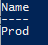

Ucs-Puptr aims to make management of configurations for your environment very simple.
You can easily remove a configuration:

# Remove Puptr Configuration

First let's assume we have two configurations: Test and Prod.

Running Get-PuptrConfig would show:

[](images/get-puptrconfig1.png)

If we want to remove the Test configuration, we would run:

```PowerShell
Remove-PuptrConfig -Name Test
```

Since this is a destructive action, you will be required to confirm:

[](images/remove-confirm.png)

If we confirm, and then run Get-PuptrConfig again:

[](images/get-puptrconfig.png)

Voila! Test is gone.