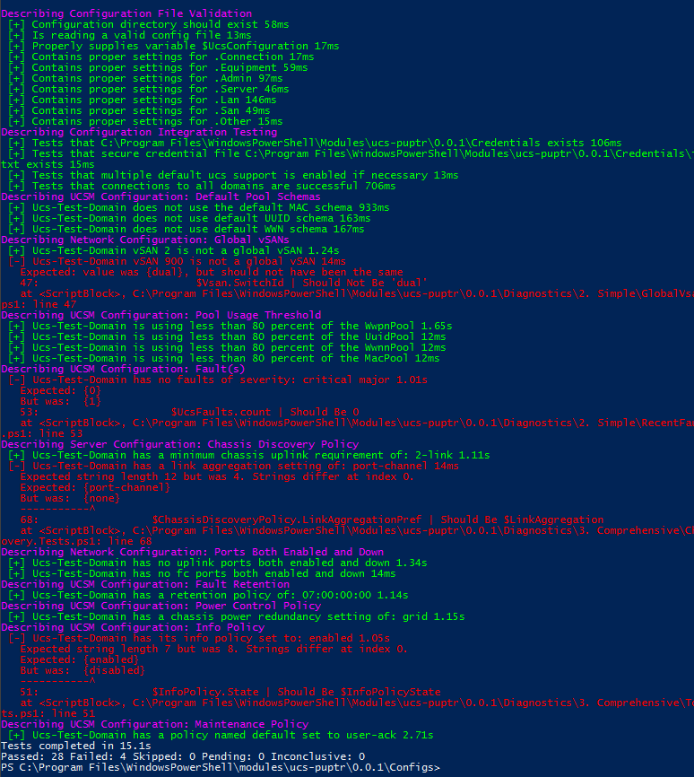

# Ucs-Puptr Docs

Welcome to Ucs-Puptr Documentation

## Contributions welcome

Everyone is welcome to contribute to this project. The goal is to add fine-grained tests that look at specific values 
within a Cisco UCS environment, compare them to defined configuration value, and optionally remediate discrepancies if 
the user so decides. However, there is nothing wrong with submitting a pull request (PR) with a non-remediating test. 
This is a great starting point for those newer to coding with PowerShell!

### Contribution Requirements

See [Contributing.Md](https://github.com/FooBartn/Ucs-Puptr/blob/master/Contributing.md) in GitHub repository.

## Running Example

